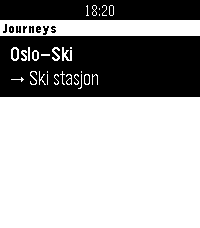
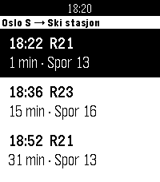
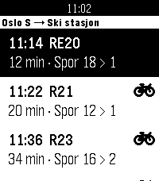
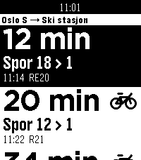

# Entur Departures

A Pebble smartwatch app that shows the next public-transport departures for a set
of predefined **journeys** — where the travel **direction is chosen automatically
from your GPS location**. Standing near Oslo S shows *Oslo S → Ski* trains;
standing near Ski shows *Ski → Oslo S*. Powered by [Entur](https://entur.no)'s
open real-time APIs for Norway.

Built for **Pebble Time 2 (emery)**.

 

## Features

- **Predefined journeys** — each is a fixed pair of stops (e.g. Oslo S ↔ Ski).
- **Automatic direction** — the phone's location picks the nearer stop as the
  origin, so you always see departures the way you're actually travelling.
- **Live departures** with realtime-adjusted times and a minutes-until countdown.
- **Boarding and arrival track** for each departure — `Spor 3 > 18` means board
  at track 3 and arrive at track 18 (`Pl.` instead of `Spor` for bus/tram). Seeing
  the arrival track is what lets you pick between two trains leaving at nearly
  the same time when some platforms are easier to reach than others.
- **Big text mode, per journey** — a toggle in the phone settings switches that
  journey's board to a large, glanceable layout: countdown in 42px, track in
  bold underneath, clock and line code small below. About two departures fit on
  screen instead of three. Set it on the journeys you ride a bike to and leave it
  off for the ones where you can stop and read properly.
- **Bike-friendly trains, per journey** — a second toggle puts a bike symbol
  on departures that are easy to roll a bike on and off: step-free doors and an
  open multi-purpose area rather than steps and a cramped vestibule. See
  [Bike-friendly trains](#bike-friendly-trains).
- **Phone-configurable** via a Clay settings page — no rebuild to change journeys.

## How it works

All network and geo work happens on the phone in PebbleKit JS; the watch is a thin
display layer driven by AppMessage.

```
Watch (C, MenuLayer)  ⇄  AppMessage  ⇄  Phone (PebbleKit JS)  ⇄  Entur APIs
  journeys list                            geocode stop names → NSR ids
  departure board                          GPS → nearest stop = origin
                                           JourneyPlanner v3 `trip` query
```

- **`src/c/main.c`** — two windows: a `MenuLayer` of journeys and a departure
  board, the latter drawn either with the default cell or a custom large-text
  cell. Parses compact strings from the phone; persists the last list for an
  instant cold-launch.
- **`src/pkjs/index.js`** — reads Clay settings, geocodes stop names to
  `NSR:StopPlace` ids (cached in `localStorage`), gets GPS, picks direction by
  haversine distance, and queries the Entur JourneyPlanner v3 `trip` endpoint.
- **`src/pkjs/config.js`** — the Clay configuration page (4 journey slots each
  with big-text and bike toggles, the bike-friendly train list,
  departures-to-show, Entur client name).

### Staying fast

Entur answers a trip query in ~200 ms, so anything slower than that was our own
doing. Three things keep the board quick:

- **The GPS is never on the critical path.** The last fix is persisted and used
  immediately; a refresh runs in the background. Deciding which of two stops is
  nearer tolerates a fix that is minutes old and hundreds of metres off, and
  waiting for a fresh one used to cost up to 15 s per open.
- **Boards are prefetched at launch.** Phone-side JS only runs while the app is
  in the foreground, so opening the app is exactly the moment to warm every
  journey's board. Departure times are cached as ISO timestamps and re-rendered
  on send, so a cached board shows correct countdowns rather than stale ones.
- **Every request has a watchdog.** The phone can go quiet for reasons the watch
  cannot see — JS not up yet, a busy outbox, a geolocation callback that fires
  neither success nor error. Requests are retried up to 3 times, 5 s apart, and
  then fail to a `SELECT to retry` row instead of spinning forever.

### Entur APIs

Open under [NLOD](https://data.norge.no/nlod/en/2.0) — **no API key**. The only
requirement is an `ET-Client-Name: <company>-<application>` header on every request.

- JourneyPlanner v3 GraphQL — `https://api.entur.io/journey-planner/v3/graphql`
- Geocoder — `https://api.entur.io/geocoder/v1/autocomplete`

Set your own client name in the app's phone settings.

## Build & install

Requires the modern Pebble toolchain (`pebble-tool` + SDK). See
[developer.repebble.com](https://developer.repebble.com/sdk/).

```bash
pebble build

# emulator
pebble install --emulator emery

# real watch (phone developer connection)
pebble install --phone <phone-ip>
```

## Configure

Open the Pebble phone app → **Entur Departures** → settings (gear), then fill in
up to four journeys. Type a stop **name** (e.g. `Oslo S`, `Nydalen`) — it's
geocoded on save — or paste an exact `NSR:StopPlace:XXXXX` id if a name is
ambiguous. Ships with a default **Oslo–Ski** journey so it works out of the box.

Each journey has its own **Big text** toggle for the glanceable board and its
own **Mark bike-friendly trains** toggle.

## Bike-friendly trains

 

Entur's journey planner has no rolling-stock data (`bikesAllowed` is
`noInformation` for every Vy departure), so "bike-friendly" is a list you
control in settings: line codes and/or train numbers, comma separated. A
departure is marked when its line code (`R21`) or train number (`1107`) is in the
list.

The default, **`R21, R22, R23`**, is chosen for Oslo S ↔ Ski:

| Line | Route | Usual train | Bikes |
|------|-------|-------------|-------|
| R21 | Stabekk–Oslo S–Moss | Type 75 (Stadler Flirt) | Step-free doors, multi-purpose area — easy |
| R22 | Skøyen–Oslo S–Mysen/Rakkestad | Type 75 | Easy |
| R23 | Stabekk–Oslo S–Ski(–Moss) | Type 75 | Easy |
| RE20 | Oslo S–Halden–Göteborg | Type 74 (Flirt), rush-hour extras Type 73B | Usually step-free, but a 73B has steps and a small bike room behind the cab; Vy recommends reserving a bike space |

RE20 is left out because a given departure could be either. If you learn which
RE20 train numbers reliably run Type 74, add them by number (e.g. `R21, R22,
R23, 105, 107`). The same list works for any other journey — put in whichever
lines suit bikes there.

## Navigation

| Screen | UP / DOWN | SELECT | BACK |
|--------|-----------|--------|------|
| Journeys list | scroll | open board | exit |
| Departure board | scroll | refresh | back to list |

## License

MIT
